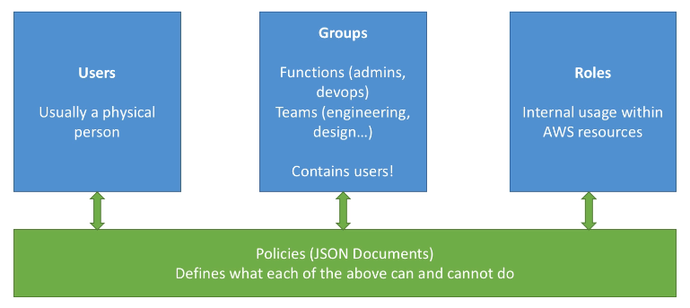

# IAM Introduction

* Identity and Access Management
* Users, Groups, Roles
* Root account should never be used
* Policies are written in JSON

* IAM has global view
* Has predefined "managed policies"
* Best practice to give least privileged principles - minimum permissions

# IAM Federation

* Big enterprises usually use own repository of users with IAM
* Can log into AWS with their company credentials (like SAML)

# IAM 101 Brain Dump

* One IAM user per physical person
* One IAM role per application
* Never share, hardcode, commit creds