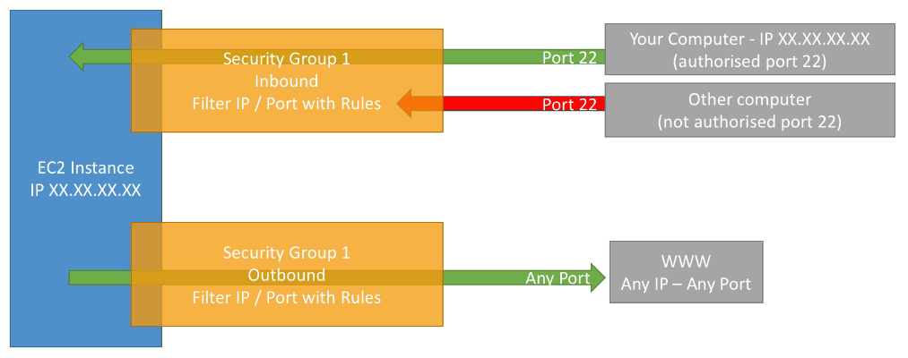

## Security Groups Deeper Dive

* SGs act as "firewall" on EC2 instances
* Regulate
  * Access to ports
  * Authorized CIDR ranges IPv4/IPv6
  * Control inbounce/outbound network

## Diagram

## Good to know

* Can be attached to multiple instances
* Locked down to region/VPC combination
* Lives "outside" of EC2 - if traffic is blocked the EC2 instance won't see it
* Good practice to maintain one separate security group for SSH access
* All inbound blocked by default
* All outbound allowed by default

## Referencing other security groups

* Can whitelist security groups
* If other instance has security group that is whitelisted, can reach this instance against the whitelisted port