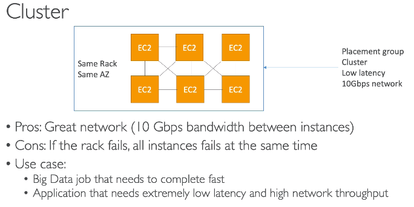
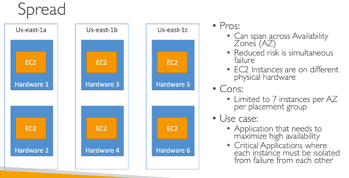
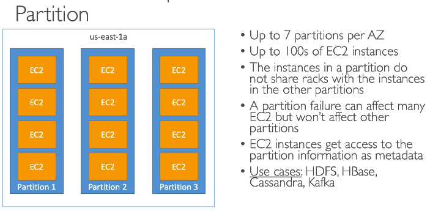

## Placement Groups

* Control EC2 instance placement strategy
* 3 strategies available:
  * Cluster - low-latency group in single AZ
  * Spread - across underlying hardware (max 7 instance per group per AZ) - critical applications
  * Partition - across different partitions (rely on different sets of racks) within an AZ. Scales to 100s of EC2 instances per group

