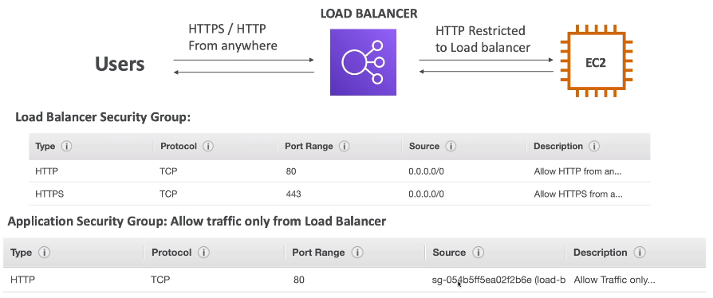

## Load Balancing

* Forward internet traffic to multiple servers (EC2 Instances) downstream

## Why use LB

* Spread load across multiple instances
* Expose single point of access (DNS) to app
* Seamlessly handle failures of downstream instances
* Do health checks on instances
* Provide SSL termination
* Enforce stickiness with cookies
* HA across zones
* Separate public traffic from private traffic

## Why use EC2 Load Balancer

* ELB (EC2 Load Balancer) is managed LB
  * Guarantees will be working
  * Takes care of upgrades, maintenance, HA
  * Provides only a few configuration knobs
* Costs less to setup own LB, but will be more effort
* Integrated with many AWS services

## Health Checks

* Enable LB to know if instances it forwards traffic to are available to reply to requests
* Done on port and route (/health is common)
* If response is not 200, then instance is unhealthy

## Types of LB on AWS

* AWS has 3 kinds of managed LBs
  * Classic Load Balancer (v1 - 2009)
    * HTTP, HTTPS, TCP
  * Application Load Balancer (v2 - new generation 2016)
    * HTTP, HTTPS, WebSocket
  * Network Load Balancer (v2 - new generation 2017)
    * TCP, TLS, UDP
* Internal or external ELBs

## Load Balancer Security Groups

## Good to know

* LB can scale, but instantaenously
* Troubleshooting
  * 4xx - client errors
  * 5xx - app errors
  * 503 - at capacity or no registered target
  * Check SG
* Monitoring
  * ELB access logs will log all access requests
  * CloudWatch Metrics will give aggregate stats (ex: connections count)